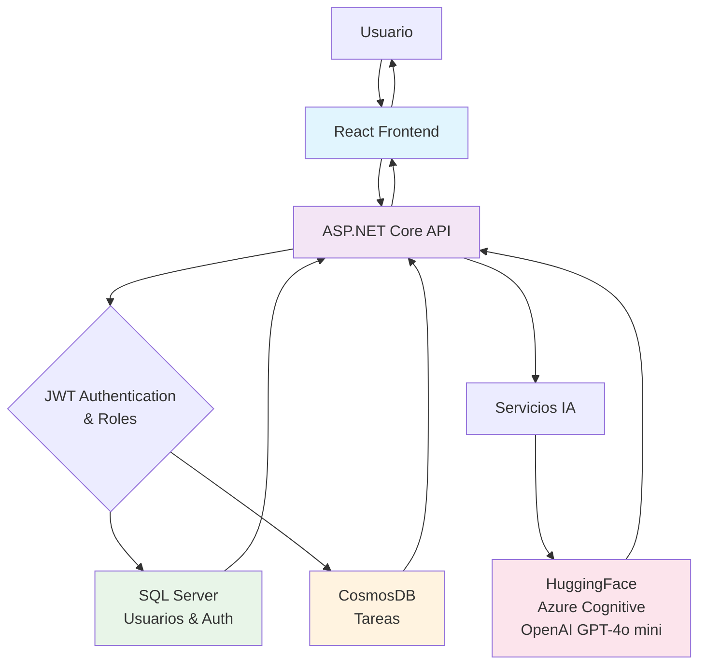

# 🖥️ TaskManager Frontend — React + Vite + TailwindCSS

Aplicación frontend del proyecto **TaskManager**, desarrollada con **React**, **Vite**, **TypeScript** y **TailwindCSS**.
Este frontend consume la API del backend para gestionar tareas, autenticar usuarios con JWT y mostrar análisis de IA.

---

## 🚀 Características principales

* Login y registro de usuarios
* Gestión de roles (Admin/User) con restricciones de acceso
* Listado, creación, edición y eliminación de tareas
* Completado de tareas
* Llamadas al servicio IA:

  * **Análisis de tareas (resumen y prioridad)**
  * **Generación de subtareas**
* Cliente HTTP centralizado con refresh automático de tokens (`useApi.ts`)
* Error Boundary para manejo de errores en la UI
* Interfaz moderna con TailwindCSS
* Integración con React Router

---

# 📦 Instalación del Frontend

## 1️⃣ Requisitos previos

Asegúrate de tener instalado:

* **Node.js 18+**
* **npm** o **yarn**
* Backend ejecutándose en:

  ```
  https://localhost:7179
  ```

---

## 2️⃣ Clonar el repositorio

```bash
git clone https://github.com/jeann2013/TestTaskControlRiskFrontend.git
```

Luego entra al frontend:

```bash
cd TestTaskControlRiskFrontend
```

---

## 3️⃣ Instalar dependencias

```bash
npm install
```

---

## 4️⃣ Archivo de configuración `.env`

Crear un archivo `.env` en la raíz del frontend:

```
VITE_API_URL=https://localhost:7179
```

---

## 5️⃣ Ejecutar el proyecto en modo desarrollo

```bash
npm run dev
```

La aplicación abrirá en:

```
http://localhost:5173
```

---

# 🏗️ Estructura del Proyecto

```
taskmanager-frontend/
│
├── src/
│   ├── auth/
│   │   ├── useAuthStore.js
│   │   └── ProtectedRoute.jsx
│   │
│   ├── components/
│   │   ├── ErrorBoundary.tsx
│   │   └── PrivateRoute.tsx
│   │
│   ├── hooks/
│   │   ├── useApi.ts
│   │   └── useAuth.js
│   │
│   ├── pages/
│   │   ├── Login.tsx
│   │   ├── Register.tsx
│   │   ├── TasksPage.tsx
│   │   └── CreateTaskPage.tsx
│   │
│   ├── api/
│   │   └── client.js
│   │
│   ├── App.tsx
│   ├── main.tsx
│   └── index.css
│
├── public/
│
├── vite.config.ts
├── tsconfig.json
├── tsconfig.app.json
├── tsconfig.jest.json
├── tsconfig.node.json
├── jest.config.cjs
├── tailwind.config.js
├── postcss.config.js
└── package.json
```

---

# 🔌 Comunicación con el Backend

El frontend consume la API mediante el hook:

```
src/hooks/useApi.ts
```

Incluye:

* Headers automáticos con Authorization Bearer
* Gestión de tokens JWT con refresh automático
* Manejo de errores y logout en 401
* Cliente unificado para todas las llamadas autenticadas

---

# 🧪 Scripts disponibles

| Script            | Descripción                       |
| ----------------- | --------------------------------- |
| `npm run dev`     | Ejecuta la app en modo desarrollo |
| `npm run build`   | Crea el build de producción       |
| `npm run preview` | Previsualiza el build             |
| `npm test`     | Ejecuta los Tests |

---

# 📄 Build de producción

Ejecutar:

```bash
npm run build
```

Luego:

```bash
npm run preview
```

Se abrirá un servidor local para probar el build.

---

# 📚 Documentación de la API

La aplicación frontend consume los siguientes endpoints del backend:

## Autenticación
- `POST /auth/login` - Login de usuario (devuelve token y refreshToken)
- `POST /auth/register` - Registro de usuario
- `POST /auth/refresh` - Refresh del token JWT

## Tareas
- `GET /tasks?Page=1&PageSize=10` - Listar tareas paginadas
- `POST /tasks` - Crear nueva tarea
- `PUT /tasks/{id}` - Actualizar tarea
- `DELETE /tasks/{id}` - Eliminar tarea
- `PATCH /tasks/{id}/complete` - Marcar tarea como completada

## IA
- `POST /tasks/analyze` - Analizar tarea (resumen y prioridad)
- `POST /tasks/suggest` - Generar subtareas sugeridas

**Nota**: El backend debería proporcionar documentación Swagger/OpenAPI en una ruta como `/swagger` para referencia completa.

---

# 🏛️ Arquitectura del Sistema



**Flujo de Datos:**
1. El usuario interactúa con la interfaz React
2. React realiza llamadas HTTP a la API ASP.NET Core
3. La API valida JWT y roles de usuario
4. Datos de usuarios se almacenan en SQL Server
5. Datos de tareas se almacenan en CosmosDB
6. Para análisis IA, la API llama a servicios externos
7. Respuestas fluyen de vuelta al frontend

---

# 💡 Notas

* Si cambias la URL del backend, actualiza el `.env`.
* TailwindCSS recompilará la UI automáticamente.
* La app incluye manejo de roles: solo Admin puede crear y eliminar tareas.
* Error Boundary captura errores de UI y muestra mensajes amigables.

---

¿Quieres también un README para el backend o uno combinado para todo el proyecto?
